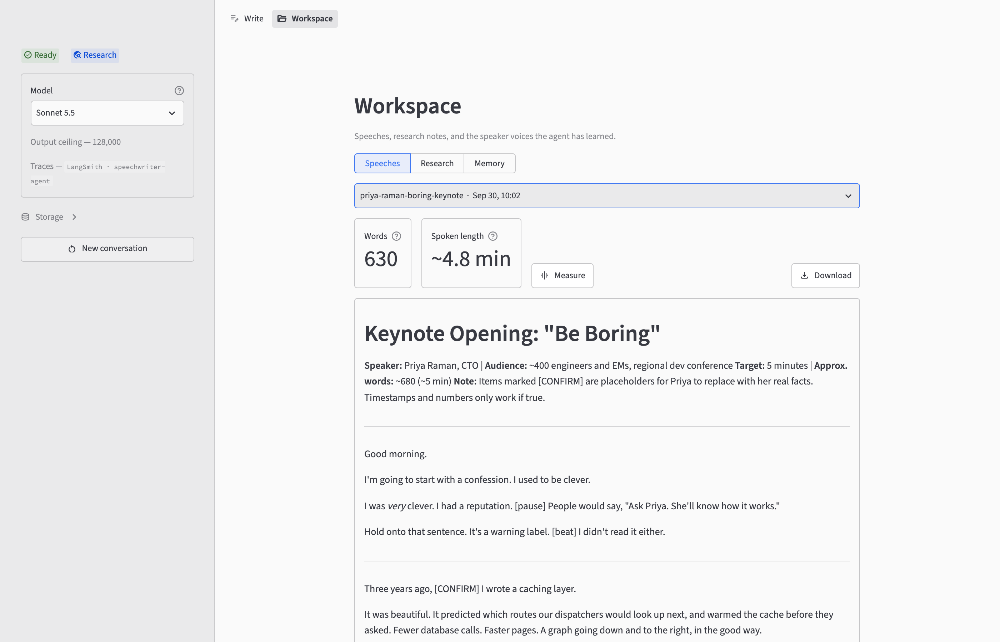
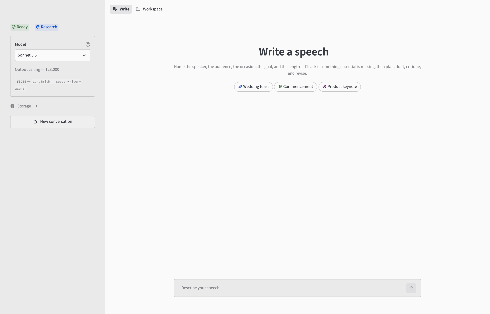

# Speechwriter Agent

A speechwriter built with **[Deep Agents](https://docs.langchain.com/oss/python/deepagents/overview)** (LangChain + LangGraph). Describe the speaker, audience, occasion and goal. The agent researches facts, drafts a speech written *for the ear*, critiques and revises its draft, and **remembers how each speaker sounds** across sessions.

```
you › Write a 4-minute wedding toast. Speaker: David, best man. Audience: 80 guests,
      mixed ages. Couple: Ana & Priya, met hiking. Warm, a little funny, no clichés.

  ⚙  read_file         {"file_path":"/skills/audience-and-occasion/SKILL.md","limit":1000}
  ⚙  task              {"subagent_type":"style-critic","description":"Critique toast draft"}
  ✓  task: Verdict 8/10. Tighten the open; the hiking callback lands. …
  ⚙  write_file        {"file_path":"/workspace/speeches/ana-priya-toast.md", …}
╭─ speechwriter ───────────────────────────────────────────────────────────────╮
│  Here's the toast — about 3 minutes 40 at a relaxed pace. …                   │
╰──────────────────────────────────────────────────────────────────────────────╯
```

The same agent runs in the browser. Here is a finished draft in the Workspace view, with its word count and estimated spoken length:

<picture>
  <source media="(prefers-color-scheme: dark)" srcset="docs/images/workspace-dark.png">
  
</picture>

---

## How it works

A speech is a long-horizon task: intake → research → outline → draft → critique → revise. Deep Agents already provides most of what that needs, so this project mostly *configures* the harness rather than building one.

| Need | Deep Agents feature | Where |
|---|---|---|
| Work through the stages | A staged rhythm in the system prompt (there is no planning tool) | [`prompts.py`](src/speechwriter/prompts.py) |
| Keep drafts and research notes | Filesystem tools + `FilesystemBackend` | [`agent.py`](src/speechwriter/agent.py) |
| Look up facts without cluttering the writing context | `researcher` subagent (Tavily) | [`subagents.py`](src/speechwriter/subagents.py) |
| A hard editorial pass | `style-critic` subagent | [`subagents.py`](src/speechwriter/subagents.py) |
| Rhetoric know-how, loaded on demand | Skills (`SKILL.md`) | [`skills/`](skills/) |
| Remember a speaker's voice across sessions | `StoreBackend` via `CompositeBackend` | [`agent.py`](src/speechwriter/agent.py), [`memory.py`](src/speechwriter/memory.py) |

### Memory

The agent's filesystem is a `CompositeBackend` that routes by path prefix:

```
/skills/      → FilesystemBackend   read-only rhetoric library
/workspace/   → FilesystemBackend   real .md files on disk (drafts, research notes)
/memories/    → StoreBackend        speaker voice profiles, persisted across sessions
```

Writes to `/memories/` go to a LangGraph `Store` and never reach disk as files. The local store is an `InMemoryStore`, so [`memory.py`](src/speechwriter/memory.py) saves it to `.speechwriter/memory-store.json` and reloads it on startup. Swap in `PostgresStore` there to make it multi-user.

Knowledge is split in two:

- **Principles live in code.** How to write *any* speech is in the system prompt and the skills.
- **A speaker's voice lives in memory.** What is specific to *this* speaker is in `/memories/<speaker>.md`.

Writes are confined to `/workspace` and `/memories/` by a permission sandbox that the harness enforces, not one the prompt merely requests.

---

## Setup

Requires **Python ≥ 3.11** and [uv](https://docs.astral.sh/uv/).

```bash
uv sync                  # install into .venv from the lockfile
cp .env.example .env     # then fill in your keys
```

Only the Anthropic key is required:

```ini
ANTHROPIC_API_KEY=sk-ant-...     # required: the model that writes
TAVILY_API_KEY=tvly-...          # optional: live web research
DEEPGRAM_API_KEY=...             # optional: measure a draft's spoken length
LANGSMITH_TRACING=true           # optional: trace every turn to LangSmith
LANGSMITH_API_KEY=lsv2_...       # optional: the key traces upload with
```

- **Without a Tavily key**, the agent writes from its own knowledge and marks anything it can't verify with `[VERIFY]`.
- **Without an Anthropic key**, both front ends still open so you can check the configuration, but they won't run a commission.

---

## Usage

There are two front ends. Both share the same agent, workspace and memory.

### Terminal

```bash
uv run speechwriter      # or: uv run python -m speechwriter
```

Give it as much of the brief as you can. It asks for anything essential that's missing.

> Draft a 12-minute commencement address for a state university. Speaker is a first-gen founder. One big idea: "usefulness beats prestige." Warm, story-driven, one good laugh.

- Speeches are saved to `workspace/speeches/`, research notes to `workspace/research/`.
- `/model` lists and switches models.
- `exit` or `Ctrl-D` quits and saves memory.

### Browser

```bash
uv run streamlit run streamlit_app.py
```

- **Write**: commission a speech and follow the agent's activity live. Memory is saved after every turn.
- **Workspace**: browse drafts (with a spoken-length estimate and a **Measure** button), research notes, and learned voice profiles.

<picture>
  <source media="(prefers-color-scheme: dark)" srcset="docs/images/write-dark.png">
  
</picture>

The app binds to `localhost` only, because it spends your API budget and writes to your workspace. Pass `--server.address` to override this.

### Configuration

| Variable | Default | Purpose |
|---|---|---|
| `ANTHROPIC_API_KEY` | — | Required. A wrong key fails at the first turn. |
| `SPEECHWRITER_MODEL` | `claude-sonnet-5-5` | The model to start on. See [Switching models](#switching-models). |
| `SPEECHWRITER_MAX_TOKENS` | model's maximum | Output-token ceiling override. Unset, known models use their real maximum (128k for the 5.5 models) and unknown ids get 32,000. |
| `SPEECHWRITER_MAX_RESEARCH_RESULTS` | `5` | Tavily results per query. |
| `SPEECHWRITER_HOME` | repo root | Directory the agent reads and writes under. |
| `TAVILY_API_KEY` | — | Enables the `researcher` subagent. |
| `DEEPGRAM_API_KEY` | — | Enables the **Measure** button. |
| `LANGSMITH_TRACING` | — | `true` traces every turn to LangSmith. |
| `LANGSMITH_API_KEY` | — | Used for traces, the eval mirror and experiments. |
| `LANGSMITH_PROJECT` | `speechwriter-agent` | The project traces land in. |
| `LANGSMITH_ENDPOINT` | hosted API | Only needed for self-hosted LangSmith. |

Some settings are fixed in code because the 5.5 models require them: adaptive thinking with summarized display, `effort: medium`, and Anthropic's server-side refusal fallback. `temperature`, `top_p` and `top_k` are never sent, because the 5.5 models reject them.

### Switching models

Switch without restarting: use the sidebar dropdown in the browser, or `/model` in the terminal.

```
› /model
 › 1  Sonnet 5.5   claude-sonnet-5-5
   2  Opus 5.5     claude-opus-5-5
Switch with /model <number> or /model <name>.
```

Sonnet 5.5 is the default. Use Opus 5.5 when the draft matters most. A `SPEECHWRITER_MODEL` that isn't on the list gets its own row, so you can always switch back to it.

- **Switching rebuilds the agent.** Voice profiles are saved first and survive the switch. The conversation does not, so a new thread starts.
- **`SPEECHWRITER_MAX_TOKENS` applies to every model.** If the override is above the new model's maximum, the ceiling line warns you before the first turn fails.

### Tracing

With `LANGSMITH_TRACING=true` and `LANGSMITH_API_KEY` set, every model call, tool call and subagent run is traced to [LangSmith](https://docs.smith.langchain.com), nested the way it happened. LangChain does the tracing, so there is nothing else to configure.

- Both front ends show where traces are going before the first turn: the banner's `traces` line in the terminal, the **Traces** caption in the browser.
- Each conversation is one LangSmith thread. A new conversation starts a new thread.
- If tracing is on but the key is missing, the front ends say so.
- The terminal waits for pending uploads at `exit`, so the last turn isn't lost.

### Measuring spoken length

The Workspace page estimates each draft's length from a fixed words-per-minute pace. With `DEEPGRAM_API_KEY` set, **Measure** reads the draft aloud with [Deepgram Aura-2](https://developers.deepgram.com/docs/tts-models), reports the real duration and plays it back. Each draft is measured once and cached, and a revised draft is measured again.

The two numbers answer different questions. A TTS voice reads faster than a person on stage and doesn't pause for laughter, applause or `[pause]` cues. The estimate is closer to *time on stage*. The measurement is closer to *time to say the words*.

### Evals

`evals/datasets/` holds 55 graded examples in four datasets, mirrored to LangSmith.

```bash
uv run python evals/run_experiment.py --dry-run          # check the eval wiring offline (free)
uv run python evals/sync_datasets.py                     # is the LangSmith mirror in sync?
uv run python evals/sync_datasets.py --push              # make it so
uv run python evals/run_experiment.py --langsmith --dataset trajectory --limit 1   # costs tokens
```

The files in this repo are the source of truth. A push never deletes an example unless you pass `--allow-delete`, because LangSmith deletes can't be undone. An experiment refuses to run against a stale mirror. Each criterion is recorded as its own feedback column. Anything no scorer could measure is reported as `criteria_coverage` and never counted as a pass.

---

## Using it as a library

`build_agent()` returns a bundle around a compiled LangGraph graph:

```python
from speechwriter import build_agent

bundle = build_agent()
result = bundle.agent.invoke(
    {"messages": [{"role": "user", "content": "Write a 2-minute retirement toast for Sam."}]},
    config=bundle.turn_config("demo"),   # thread id + truncation detection
)
print(result["messages"][-1].content)

if bundle.warner.truncated:   # a clipped draft looks exactly like a finished one
    print("Raise SPEECHWRITER_MAX_TOKENS")

bundle.persist()   # save learned voice profiles for the next run
```

Call `bundle.persist()` yourself. Nothing else saves memory when you use the library directly.

---

## Project layout

```
src/speechwriter/
├── config.py        Settings: model, keys, paths (single source of truth)
├── prompts.py       System prompts for the orchestrator, researcher and critic
├── tools.py         Tavily research tool, built only when a key is set
├── subagents.py     researcher and style-critic definitions
├── memory.py        Store snapshot: load, save, exhaustive read
├── tracing.py       Reports and flushes LangSmith tracing
├── observability.py TruncationWarner: flags truncated or refused responses
├── transcript.py    Message → event decoding shared by both front ends
├── agent.py         build_agent(): composes everything into one graph
├── cli.py           Terminal REPL
├── workspace.py     Reads drafts, notes and profiles; Deepgram timing
└── webui.py         Streamlit glue: stream, record and replay a turn
streamlit_app.py     Web entry point
app_pages/           Write and Workspace pages
skills/              Rhetoric library: rhetorical-devices, speech-structures,
                     delivery-and-cadence, audience-and-occasion
tests/               Offline test suite
evals/               Eval datasets, scorers and the LangSmith harness
```

---

## Development

```bash
uv run pytest               # offline: no API key or network needed
uvx ruff@0.16.0 check .
uvx ruff@0.16.0 format .
uvx ty@0.0.63 check
```

The tests build the full agent graph without calling the model or the network, so they're free to run.

[CI](.github/workflows/ci.yml) runs all three checks on every push to `main` and every pull request, on Python 3.11, 3.12 and 3.13. The workflow sets no API keys, so CI fails if building the agent ever starts to need the network. CI reports results but doesn't block merges.

---

## License

Released under the [MIT License](LICENSE) — © 2026 Daryl Lim.
